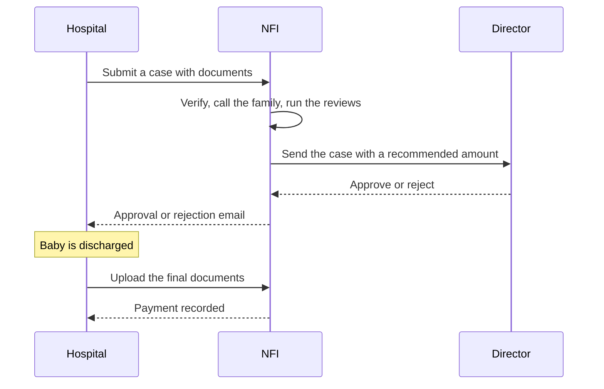

<div align="center" markdown="1">

<picture>
	<source media="(prefers-color-scheme: dark)" srcset="nfi/public/images/nfi-logo-dark.png" />
	
</picture>
<h1>NFI</h1>

**Case management for newborn NICU sponsorship**

<p>
	
	
	
	
	
</p>

</div>

NFI lets a newborn-care foundation take sponsorship requests from partner hospitals and carry each one from intake to payment in one case record. Hospitals submit cases, the foundation's coordinator verifies them and runs the reviews, a director approves the amount, and the accountant pays after discharge. Read the **[user guide](https://agrawalrahul.in/nfi)**. For scope and the data model, see [docs/phases.md](docs/phases.md) and [docs/backend.md](docs/backend.md).

### Programs

- **BRP**: medical review, then social and financial review in parallel, then director approval
- **BCRP**: medical review, then director approval
- **BARP**: the hospital decides the amount; NFI verifies and the director approves
- **TBC**: total body cooling, with a fixed sponsorship amount
- **SRT**: surfactant therapy, sponsored per vial

### Features

- Hospital contacts submit cases and upload documents, and see only their own hospitals' cases
- Document checklist per program, with mandatory documents checked before submission
- Return a case to the hospital for corrections, or reject it with a reason
- Beneficiary call notes and a review log of committee queries, answers and decisions
- Approval and rejection emails to the hospital, with the amount in figures and words
- Partial and full payments, with the status worked out from the amounts paid
- Top-up cases linked to the original case
- A workspace per role, a coordinator Case Desk, a Payments page, print formats and register reports

### How it works



### Installation

You need Frappe 17 (the develop branch).

```bash
bench get-app https://github.com/Rl0007/nfi --branch develop
bench --site your.site install-app nfi
```

Then add your hospitals and their contacts, and check the document checklist on each program.

### Adding a program

Create a new NFI Program record, pick its review route, set a fixed amount if it has one, and list its intake and discharge documents. No code is needed. Then enable the program on each hospital that offers it and choose its director.

### Development

```bash
bench --site your.site execute nfi.demo.make   # demo hospitals, cases and one user per role (password: admin)
bench --site your.site execute nfi.demo.clear
```

### Support

Found a bug or have a question? [Open an issue](https://github.com/Rl0007/nfi/issues).

## Built by Rahul Agrawal

NFI is built and maintained by [Rahul Agrawal](https://agrawalrahul.in).

#### License

MIT
